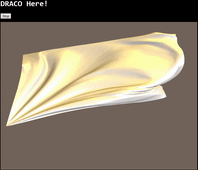

# Compression for 3d Model Sequence Animation Online
In this project, we built a demo website of viewing mesh animation with free interaction. To reduce the network load, we tried two different compression methods.

One is "[Streaming compressed 3D data on the web using JavaScript and WebGL](https://dl.acm.org/citation.cfm?id=2466539)" since we got no efficient library available at the start of the project. Several months later, google released its [draco](https://github.com/google/draco) and we quickly developed the second website based on the new technology.

## Distortion
origin: v -6.537736 13.503677 28.752518

transfered: v -6.53272 13.5135 28.808

## Performance Comparison
+ 4225 vertices * 15bit * 3
+ 8192 faceties * 2byte * 3
+ sum: 74502 ~ 74K
+ ctm: 11K
+ p3d: 5.5K (10bit quant)

## Demo
not available yet.

## TODO
- [ ] Currently half-edge mesh's vertex are taged using BFS, which used to be DFS, reflect on it
- [ ] Chrome doesn't support subworker yet. Draco-js needs Subworkers.js. Otherwise, you just use Firefox.
- [ ] Segment fault in src/build/bin and no valid data available now.

## Project Calling Tree
+ index.html -> main.js
+ main.js -> decompress.js
+ debug_test.js <- decompress.js:output_info function
+ debug_test.js <- mesh_lib.js:output_info function
+ main.js -> construct viewer
+ decompress.js viewer call jym_add_model
